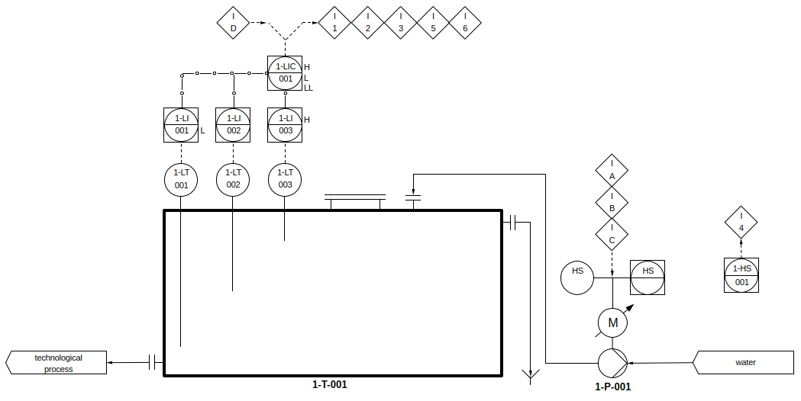

# PLC107

## YAPLC

- description of PLC107 target for IDE Beremiz YAPLC 1.2.0
  - IDE, RTE
- function blocks to control I/O channels
  - beremiz

[Beremiz YAPLC 1.2.0 PLC107 220701](https://disk.yandex.ru/d/9rnPyrfyGzz-hw)

## examples

- 1000-tech-water

